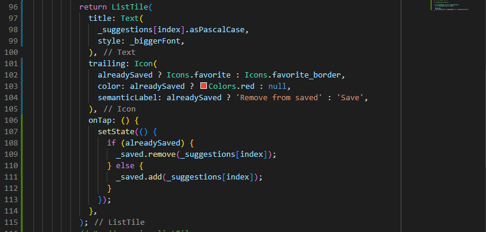
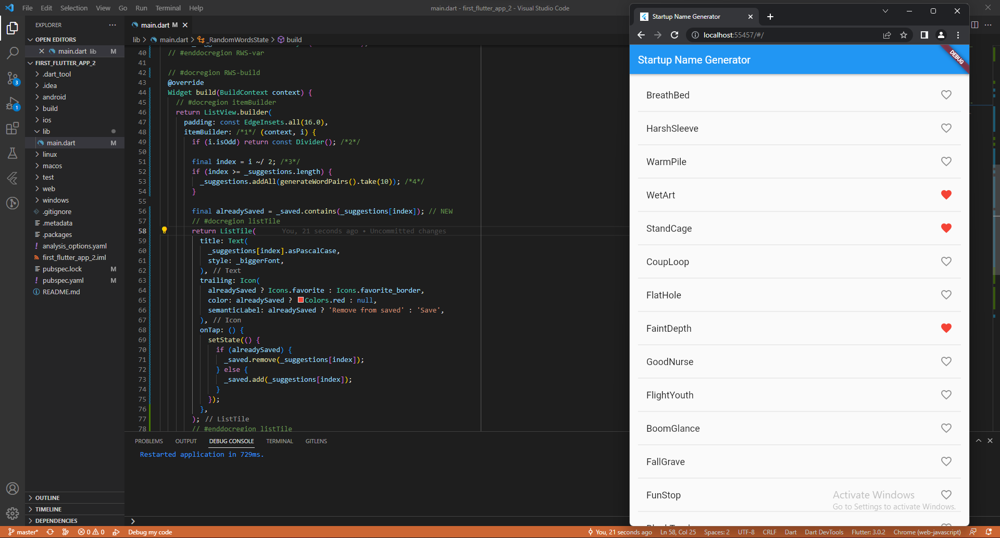

# first_flutter_app_2

A new Flutter project.

# Praktikum 1: Get the starting app

1. Pada praktikum kali ini menambahkan package english_words dengan syntax seperti berikut:

```flutter pub add english_words```


2. Hasil dari running dengan package english_words


# Praktikum 2: Add icons to the list

1. Menambahkan _saved untuk menampung kata-kata yang terdapat dalam package english_words pada class _RandomWordsState

```final _saved = <WordPair>{};```


2. Menambahkan alreadySaved untuk menampung kata-kata yang tidak ditampung pada favorite words

```final alreadySaved = _saved.contains(_suggestions[index]); // NEW```


3. Menambahkan widget ListTile dan didalam widget ListTile ditambahkan widget Icons untuk menampilkan icon favorite


# Praktikum 3: Add interactivity

1. Menambahkan properties onTap yang nantinya akan menambahkan interaksi pengguna dengan hanya 'ketuk satu kali'



- Pada praktikum ini menambahkan condition if else. Ketika pengguna melakukan interaksi dengan mengetuk tombol icon maka icon akan berubah menjadi merah. Jika tidak maka icon akan mengubah menjadi bentuk default icon.



# Praktikum 4: Navigate to a new screen